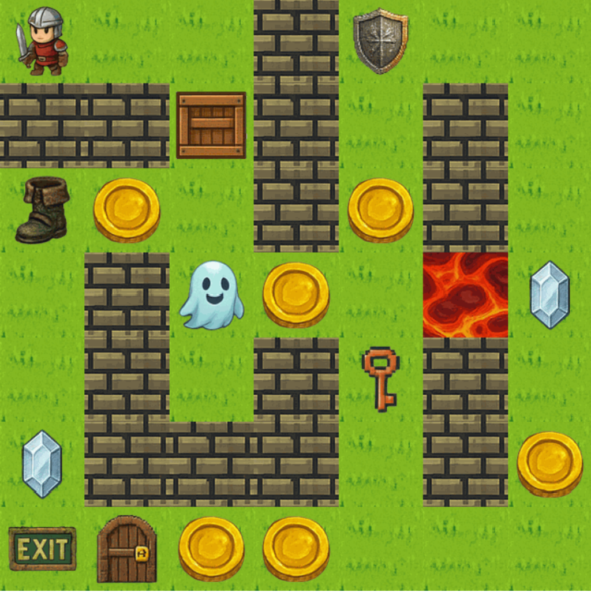
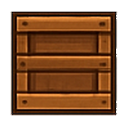
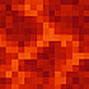
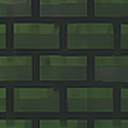
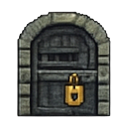
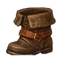
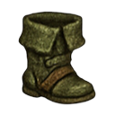
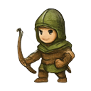
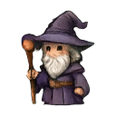

# Grid Adventure AI Agent: CNN Perception + A* Planning

Agent for a 2D grid-world game (CS2109S capstone project). The agent
collects all gems and reaches the exit while maximising reward, handling keys and
locked doors, pushable boxes, lava damage, coins and power-ups (speed, shield, phasing).

The agent receives either a structured grid state or a rendered RGBA image of the
grid. For image input, a CNN parses each tile into an entity type, the result is
converted into a search state, and A* plans the action sequence.

## Pipeline

```
RGBA image ─► split into 32×32 tiles ─► TileCNN (14 classes) ─► grid state ─► A* search ─► actions
```

## Perception: TileCNN

- **Input:** a 32×32 RGBA tile, shape (4, 32, 32). **Output:** one of 14 entity classes
  (floor, wall, exit, gem, key, locked door, lava, box, coin, boots, shield, ghost, human, opened door).
- **Architecture:** 3 conv blocks (4→16→32→64 channels, 3×3 kernels, ReLU, max pooling,
  then adaptive average pooling to 4×4), followed by a 1024→128→14 fully connected head.
- **Training data is synthesised from the game's sprite assets:**
  foreground sprites are composited onto every floor background, and background classes
  (floor, wall, lava) are augmented to balance the classes.

<p align="center">
  
  <br>
  <em>Example rendered grid given to the agent as an image observation</em>
</p>

## Sprites

There are 14 sprite classes, covering both background tiles and entities, each with its own
behaviour in the maze environment. Some examples:

| Key | Box | Lava | Wall | Locked door |
|:---:|:---:|:---:|:---:|:---:|
|  |  |  |  |  |

Within each class, the sprites vary in appearance, so the model had to generalise across
different-looking sprites of the same class:

| Boots (variant 1) | Boots (variant 20) | Human (variant 1) | Human (variant 6) |
|:---:|:---:|:---:|:---:|
|  |  |  |  |
| `boots` | `boots` | `human` | `human` |

### Augmentation experiments

| Script | Augmentation | Used for |
|---|---|---|
| `train_model_task2.py` | Background classes only: brightness/contrast (0.75–1.25), horizontal flip | Task 2 (standard rendering) |
| `train_model_task3.py` | All samples: brightness/contrast (0.75–1.25), **colour jitter (0.8–1.2)**, horizontal flip | Task 3 (colour-shifted rendering) |
| `train_model.py` | Separate foreground/background augmentation, validation split, weight decay | Earlier general configuration |

Adding colour jitter to all samples was what made the classifier robust to the
colour-shifted inputs in Task 3.

## Planning: A* search

- `SearchState` is a frozen (hashable) dataclass holding agent position, HP, keys,
  remaining gems/keys/doors, box positions and active power-ups.
- Successor generation covers movement (including box pushing, lava damage, speed and
  phasing), item pickup, and key use on locked doors.
- The heuristic is based on precomputed BFS distances to remaining objectives.
- Action costs account for turn cost, lava damage and power-up effects.

## Files

| File | Purpose |
|---|---|
| `agent.py` | Agent for structured grid-state input (Task 1) |
| `agent_with_image_parser.py` | Agent with the CNN image parser (Tasks 2 and 3) |
| `train_model*.py` | Dataset synthesis, CNN training and weight export |
| `example_data/` | Example sprites and a rendered grid used in this README |

**Embedded weights:** the trained model's weights are exported as a compressed, base64-encoded
TorchScript blob inside a `get_model()` function. That is why `agent_with_image_parser.py` is large.

## Running

Requires Python with `torch`, `numpy` and `Pillow`, plus the course-provided
`grid_adventure` package (not included), which supplies the game engine and sprite assets.

```bash
python train_model_task3.py   # trains the CNN and writes model_snippet_task3.py
```
